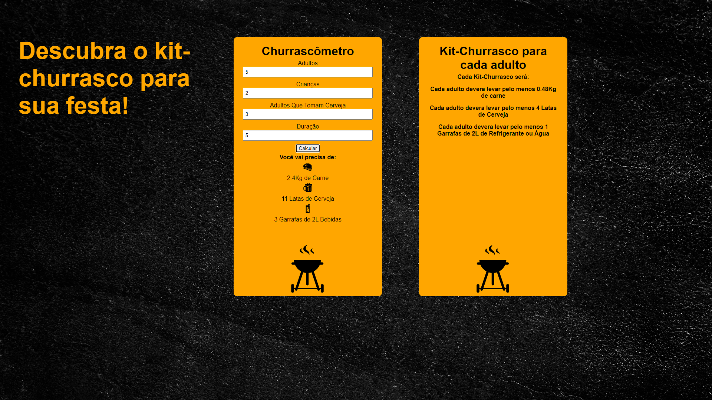

<h1 align="center"> Churrascômetro </h1>

Projeto realizado pelo cruso programadorBR  

  <a href="#-tecnologias">Tecnologias</a>&nbsp;&nbsp;&nbsp;|&nbsp;&nbsp;&nbsp;
  <a href="#-projeto">Projeto</a>&nbsp;&nbsp;&nbsp;|&nbsp;&nbsp;&nbsp;
  <a href="#-layout">Desafio</a>&nbsp;&nbsp;&nbsp;|&nbsp;&nbsp;&nbsp;
  <a href="#memo-licença">Licença</a>

  

 

  

## 🚀 Tecnologias

Esse projeto foi desenvolvido com as seguintes tecnologias:

- HTML e CSS
- JavaScript
- Git e Github

## 💻 Projeto

Churrascômetro irá calcular o quanto de carne, cerveja e refrigerante/água será necessário em um churrasco e quanto cada pessoa adulta precisara levar do que for comer e beber.

## 🔖 Desafio

Criar uma aplicação que fará a conta de quanto de carne e bebida sera necessária em um churrasco com base nas seguintes informações: 

- Carne: 400g por pessoa, mais de 6h de duração se torna 650g por pessoa 
- Cerveja: 1200ml por pessoa, mais de 6h de duração se torna 2000ml 
- Refrigerante/água: 1000ml por pessoa, mias de duração se torna 6h 1500ml
- Crianças valem por 0,5

## :memo: Licença

Esse projeto está sob a licença MIT.

---
